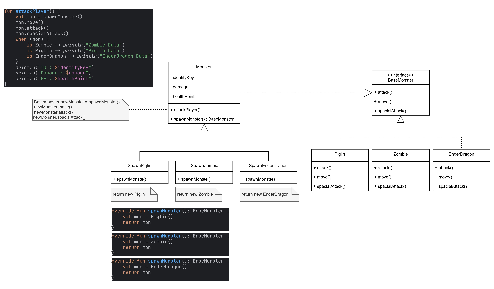

# 🏭 Factory Method

**Factory Method**  
- เป็นหนึ่งใน Creational Design Patterns ที่ใช้เพื่อสร้างอ็อบเจกต์ โดยไม่ผูกโค้ดเข้ากับคลาสคอนกรีตโดยตรง
---
**แนวคิด**
- เราอยากสร้างมอนสเตอร์หลายแบบในเกม เช่น Zombie, Piglin หรือ Ender Dragon ซึ่งแม้จะแตกต่างกัน แต่ก็มีพฤติกรรมพื้นฐานเหมือนกัน เช่น โจมตีหรือเคลื่อนที่
แทนที่จะเขียนโค้ดสร้างมอนสเตอร์แต่ละตัวเองทีละคลาส เราใช้ Factory Method เพื่อให้แต่ละมอนสเตอร์ถูกสร้างผ่าน "โรงงาน" ที่แยกออกมา ช่วยให้โค้ดเป็นระบบ ไม่ผูกกับคลาสใดคลาสหนึ่ง และสามารถเพิ่มมอนสเตอร์ใหม่ได้ง่ายในอนาคต
---

## องค์ประกอบหลักของ Factory Method Pattern

Product (Interface/Abstract Class) 

- ทำหน้าที่เป็นสัญญา (Contract) ให้กับอ็อบเจกต์ทั้งหมดที่ถูกสร้างโดย 
- เป็นคลาสฐานที่กำหนดพฤติกรรมร่วมของอ็อบเจกต์ที่ถูกสร้าง ในตัวอย่างใช้ BaseMonster
```kotlin
interface  BaseMonster {
    fun attack()
    fun move()
    fun spacialAttack()
}
```

ConcreteProduct 
- คลาสจริงที่ implement หรือสืบทอดจาก Product
- มีพฤติกรรมเฉพาะของตัวเองก็คือการสร้าง Piglin, Zombie, EnderDragon
```kotlin
class Zombie : BaseMonster {

    override fun attack() {
        println("Bite the player!!")
    }

    override fun move() {
        println("Walk towards find the player")
    }

    override fun spacialAttack() {
        println("Rushes towards the player")
    }
}
```

Creator (Abstract Class หรือ Interface)
- ประกาศเมธอด factoryMethod() ซึ่ง return Product
- อาจมีเมธอดอื่น ๆ ที่ใช้ factoryMethod() ภายในเพื่อหลีกเลี่ยงการผูกกับคลาสคอนกรีต
- บางครั้งเรียกว่า Factory
- ในที่นี้เรากำหนดเป็น Monster โดยมีเมธอด spawnMonster() ที่จะเป็น factoryMethod() ในการ return BaseMonster หรือ Product ออกมา
```kotlin
abstract class Monster(
    private val identityKey: String,
    private var damage: Double,
    private var healthPoint: Double,
) {
    //กำหนด factoryMethod()
    abstract fun spawnMonster(): BaseMonster

    fun attackPlayer() {
        val mon = spawnMonster()
        mon.move()
        mon.attack()
        mon.spacialAttack()
        when (mon) {
            is Zombie -> println("Zombie Data")
            is Piglin -> println("Piglin Data")
            is EnderDragon -> println("EnderDragon Data")
        }
        println("ID : $identityKey")
        println("Damage : $damage")
        println("HP : $healthPoint")
    }

    fun showDataMonster() {
        println("ID : $identityKey")
        println("Damage : $damage")
        println("HP : $healthPoint")
    }
}
```


ConcreteCreator
- เป็นคลาสที่สืบทอดจาก Creator
- Override เมธอด factoryMethod() เพื่อคืนค่าเป็น ConcreteProduct ที่เหมาะสม
- ตัวอย่างคลาส spawnZombie เรีกยใช้ spawnMonster() ก็ได้จะ Zombie ที่เป็น ConcreteProduct
- ผู้ใช้จะเรียกใช้ ConcreteCreator โดยไม่รู้ว่าอ็อบเจกต์จริงคืออะไร
```kotlin
class SpawnZombie(
    identityKey: String = UUID.randomUUID().toString(),
    damage: Double = 2.5,
    healthPoint: Double = 20.0,
) : Monster(identityKey, damage, healthPoint) {

    //Overide factoryMethod() ให้ Class ConcreteCreator ส่ง ConcreteProduct กลับมา
    override fun spawnMonster(): BaseMonster {
        val mon = Zombie()
        return mon
    }
}
```
implement
ทดลองการสร้าง Monster ขึ้นมา 1 ตัวจาก ConcreteCreator และลองทำการสั่งโจมตี้ player
```kotlin
fun callMonster(mon : Monster){
    mon.attackPlayer()
}

fun main() {

    println("--------Zombie--------")
    var mon : Monster = SpawnZombie()
    callMonster(mon)
    println("--------Piglin--------")
    mon = SpawnPiglin()
    callMonster(mon)
    println("--------EnderDragon--------")
    mon =  SpawnEnderDragon()
    callMonster(mon)


    println("--------Getter&Setter--------")
    mon.set(30.00,120.00)
    println(mon.getUUID())
    println(mon.getDamage())
    println(mon.getHealthPoint())
    println("--------Getter&Setter2--------")
    mon.setDamage(50.00)
    mon.setHealthPoint(300.00)
    mon.showDataMonster()
}
```
## 📈 Diagram


